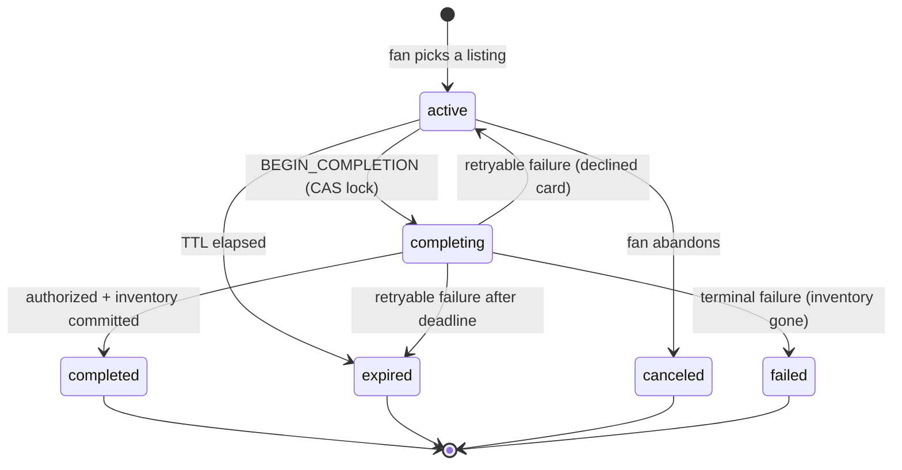

# Checkout Continuity

A fan starts buying tickets on their laptop, gets interrupted, and finishes on their phone — without
duplicate orders, stale holds, or a price that quietly changed underneath them.

```bash
pnpm install
pnpm dev      # API on :4000, web on :3000
```

Then open **http://localhost:3000/demo** — one session on two surfaces, with the controls to move
the price, pull the inventory, break the payment processor, and run the clock out.

```bash
pnpm test     # 108 tests — state machine, HTTP integration, SSE replay, pre-hydration HTML
```

### Trying it on a real phone

```bash
pnpm tunnel   # ngrok http 3000 — then open the https URL on your laptop
```

The QR on the checkout page encodes whichever host you loaded the page from, so a tunnel just works.
Same for a plain LAN address (`http://192.168.x.x:3000`) if your laptop and phone are on the same
WiFi — no tunnel, and no ngrok interstitial to tap through.

---

## The 60-second tour

From `/demo`:

1. **Raise the price $20.** Both surfaces show the drift banner within a second, both buy buttons
   disable, and neither will complete until the fan explicitly accepts.
2. **Set payment to "Slow", then press Complete on both surfaces at once.** One order is created.
   The other says *"Completing on your other device — don't buy again."*
3. **Sell out the listing.** Both surfaces go to a recovery state; the API refuses the purchase.
4. **Expire now.** Both flip to a recovery screen offering the same seats at the current price.

Nothing on that page reloads. The console fires the scenario call and stops; every change you see
arrives at the two surfaces over SSE. That is deliberate — an earlier version refreshed both iframes
after each action, which made the demo look right whether or not the push had landed.

Every one of these is also asserted headlessly in
[`checkout.integration.test.ts`](apps/api/src/routes/checkout.integration.test.ts).

---

## What's here

```
apps/api            Express 5 — source of truth, in-memory stores, SSE
apps/web            Next.js 15 App Router — desktop + mobile surfaces, demo console
packages/contracts  Zod schemas shared by both ends
```

`packages/contracts` is the API boundary. One set of schemas defines every payload; the server
validates inbound requests against them and the web app parses every response through them. Types
are inferred from the schemas, so a contract change breaks both sides at compile time rather than at
runtime in front of a fan.

Express is a separate service rather than Next route handlers because the premise is that two
independent client surfaces talk to one backend. Server Components fetch from it during SSR, so the
browser never makes the first request. Browser-side calls are proxied same-origin through
`next.config.ts`, which is also what lets one tunnel serve a phone.

---

## The checkout session state model

Two orthogonal axes — the same split Stripe makes between a Checkout Session's `status` and its
`payment_status`:

| Axis | Values |
| --- | --- |
| `status` — lifecycle | `active` · `completing` · `completed` · `expired` · `canceled` · `failed` |
| `completion.status` — the in-flight attempt | `pending` · `succeeded` · `failed` |



**"Payment pending" is not a lifecycle state.** It is `status: completing` with
`completion.status: pending`. Collapsing the two axes is how this kind of machine rots — you end up
with `active_but_price_changed_and_payment_pending`. Keeping them apart also keeps the transition
table small enough to test exhaustively, which
[`checkout-machine.test.ts`](apps/api/src/domain/checkout-machine.test.ts) does.

### Stored vs. computed

The persisted session is **the fan's agreement and nothing else**. No cached listing price, no
`hasPriceChanged` flag, no stored drift.

Everything about the world *right now* is recomputed on every read into a `CheckoutSessionView`:

```ts
{
  session,      // the agreement
  liveQuote,    // current reality — null if the listing is gone or sold out
  drift,        // the diff between them
  remainingMs,  // server-authoritative, so the first HTML paint has a real countdown
  serverTime,   // lets the client correct a skewed device clock
  canComplete,  // the server's verdict
  blockers      // …and why not
}
```

Persisting a comparison is how you end up serving a "price went up!" banner for a price that has
since gone back down.

### What lives on the client

Almost nothing: a cached copy of the view (React Query), a per-tab `clientId`, and transient UI
state. **No price, deadline, or eligibility decision is computed client-side** — `canComplete` and
`blockers` come from the server, and the button renders the server's reasoning. The client is a
renderer with a cache, not a second source of truth.

---

## How web and mobile resume the same session

The session id is the resume mechanism, and it is the URL:

```
Desktop   /checkout/{id}
Mobile    /m/checkout/{id}
Deep link /link/{id}  →  302 to the mobile surface with ?src=deeplink
```

`/link/{id}` **is** the deep link. A universal link is an HTTPS URL exactly like it — claimed by the
native app through `apple-app-site-association` when installed, falling through to the web surface
when not. That fallback is the path that matters, and it is why a deep link should never be a bare
custom scheme that dead-ends for everyone without the app.

Both routes are Server Components that fetch the same session by the same id. Nothing about resuming
is special-cased: a session is a server-owned object with a URL, and any surface that can reach the
URL can continue the purchase.

**How a surface knows the session is valid:** it doesn't decide. Every read returns `canComplete`,
`blockers`, and a server-computed `remainingMs`. Live changes arrive over SSE; if the stream drops,
the client falls back to polling and says so in the UI, because a fan looking at a possibly-stale
price deserves to know.

### The live channel

SSE rather than WebSockets: purely server→client, rides plain HTTP with no upgrade path or
sticky-session infrastructure, and `EventSource` gives reconnection for free.

The detail that matters is **`Last-Event-ID` replay**. Each session keeps a bounded ring buffer of
its last 50 events. A phone that locks, drops the connection, and reconnects sends back the last id
it processed, and we replay only what it missed. Without that, everything during the gap is lost and
the client stays stale until something else prompts a refetch — the exact failure this feature
exists to prevent, reintroduced one layer down.

Every payload carries the **full view** rather than a patch. Full-state pushes are idempotent and
order-insensitive; patches would need exactly-once delivery, which SSE does not offer. The client
keeps whichever view is newer — and "newer" is two clocks, in order:

```ts
incoming.session.version !== cached.session.version
  ? (incoming.session.version > cached.session.version ? incoming : cached)  // a write happened
  : (incoming.serverTime > cached.serverTime ? incoming : cached)            // a re-projection
```

`session.version` orders **mutations**: it is the store's compare-and-swap token and only moves when
the session is written. `serverTime` orders **re-projections of an unchanged session** — which is
exactly what a price change is. The marketplace moved; the fan's agreement did not. The stored
session is byte-identical and only `liveQuote`, `drift`, `blockers` and `canComplete` differ.

Both halves are load-bearing, and I know because I got it wrong. Ordering on version alone means
every `quote.changed` frame arrives with a version the client already has and is discarded on
receipt — the API is correct, the push is delivered, and the client throws it away. Ordering on time
alone lets a replayed projection outrank a real mutation, which is the bug the guard exists to
prevent: a late envelope walking a completed checkout back to `active`, turning the fan's
confirmation into a buy button.

This is a single-writer assumption. `serverTime` is stamped by one process; across instances the
tiebreak wants a real sequence number — a Redis stream id — not a clock.

---

## Stale inventory, price changes, and duplicate completion

### Duplicate orders — four gates

The ordering in [`completeSession`](apps/api/src/services/checkout-service.ts) is the answer. Each
gate catches a case the next cannot:

1. **`Idempotency-Key`** — the same device retrying. The key is claimed *before* the work starts, so
   a retry landing during the slow payment call sees the in-flight record rather than starting a
   second authorization.
2. **Compare-and-swap into `completing`** — two devices racing, milliseconds apart. The loser gets
   `409 COMPLETION_IN_PROGRESS` carrying `startedBySurface`, so the UI can say *"completing on your
   phone"* instead of showing an error.
3. **Terminal-state replay** — a request arriving after the order exists returns `200` with that
   order. A late retry succeeded; saying otherwise would be a lie.
4. **`UNIQUE (session_id)` on orders** — the only true invariant. It holds even if a future refactor
   forgets the other three exist.

**The critical detail is where the `await` sits.** Node being single-threaded guarantees nothing: a
handler that reads a session, awaits a payment call, then writes it back has yielded the event loop
in between, and a second request interleaves exactly there. *"Node is single-threaded so I don't
need locking"* is the reasoning behind most double-charge bugs in Node checkout code. What makes
this safe is that the compare and the write happen in one synchronous turn, and the lock is taken
**strictly before** the payment provider is awaited.

`putIfVersion` maps directly onto a Redis Lua CAS — the store interface was shaped so that swap is
mechanical rather than a redesign.

### Price changes

Every quote carries a `hash`, a digest over the priced fields that behaves like an ETag. Completion
requires **two** things:

- the hash the fan clicked with must be the live one — otherwise they are acting on a stale screen;
- the session must already have that hash **acknowledged** — otherwise a client could quietly
  re-quote and complete at a price the fan was never shown.

Only the first is satisfiable by a well-behaved client refreshing. The second is what makes *"we
never charge an unseen price"* a property of the server rather than a promise about the frontend.

A price **drop** is treated the same way. Silently re-quoting downward would be friendlier, but the
total on the confirmation must be the total the fan agreed to, in both directions.

### Stale inventory

**There is deliberately no hard hold.** Gametime is a secondary marketplace — listings are
third-party inventory that can sell on another channel at any moment. Locking seats the way a
primary vendor does would misrepresent the domain and hide the failure a continuity feature actually
has to handle: the tickets a fan is looking at stop existing while they are away.

So inventory is revalidated on every read, surfaced as `inventory_unavailable` drift, checked again
at the moment the completion lock is taken, and checked once more after authorization but before the
order is written. Three checks, because they catch different things: the read is for the banner, the
lock is the last point at which we can refuse *before spending money*, and the commit is the only
one that is authoritative.

**No hold means the failure has to be paid for somewhere, and that place is a void.** With no
reservation, two fans can both be authorized for the last pair of seats and only one can have them.
The loser has a live hold on their card at the moment we discover it, so `finalizeOrder` carries an
invariant: *any exit that does not produce a new order for this attempt releases this attempt's
authorization.* It is one `finally` over the whole body rather than a `void()` per branch,
specifically so a fourth exit added later cannot silently skip it. Not modelling this is how a
prototype quietly describes a system that charges people for nothing.

### Expiration

Both mechanisms, because either alone is a bug:

- **Lazily on read** — a fan refreshing at the wrong moment must never see a live-looking session
  whose clock has run out.
- **A 1-second sweeper** — an idle fan who never touches the page still needs their open tabs told,
  and lazy-only expiry means no SSE event ever fires.

The countdown runs off an absolute `expiresAt` corrected by server/device clock skew: a phone twenty
minutes fast would otherwise show a checkout that has already expired. One `+5 min` extension is
available, capped.

#### Submitting as the clock runs out

A deadline enforced with `expiresAt <= now` gets the boundary wrong twice, and both ways cost the
fan a checkout they should have had.

**The click that beat the clock.** *Submitted* before the deadline and *evaluated* before the
deadline are not the same instant — there is network, TLS and queueing in between. So
`BEGIN_COMPLETION`, and only `BEGIN_COMPLETION`, reads the deadline with `COMPLETION_GRACE_MS` of
slack. Extending or cancelling gets none: those are a fan acting on a dead screen, not a request
that was already in the air. The grace is invisible — the countdown still hits 0:00 at `expiresAt`,
the view still reports `expired`, and the button still goes dead — because it is slack for a request
in flight, not two more seconds of shopping. The sweeper and the lazy-expiry path hold back by the
same margin, otherwise the guarantee would be a coin flip against a 1-second background job.

**The deadline that kept running during authorization.** Taking the lock changes what the clock is
measuring. Until then it is *how long may you shop*, and expiring is right — the fan wandered off.
After it, they have committed and we are talking to a payment processor, so the remaining time is
ours. `BEGIN_COMPLETION` therefore pushes `expiresAt` out to at least `now + COMPLETION_WINDOW_MS`
in the same atomic transition that takes the lock, and does not charge it against the fan's one
extension.

That second part fixes a case worth naming, because the old test suite asserted the wrong behaviour
as correct: submit at 9:58, card declines at 10:01. A retryable decline is supposed to hand the
session back so the fan can try another card — but the session had elapsed in the meantime, so it
went to `expired` instead and they had to start over. They were charged the cost of *our* round-trip.

### Retention

Nothing is deleted at completion, and that is the point. Gate 3 needs the completed session to turn
a late retry into `200 { order }`, and the fan's other device needs it to render a confirmation it
has not seen yet — deleting at completion makes a second tap look like a failure. Stripe keeps
expired Checkout Sessions retrievable for 30 days for the same reasons.

So terminal is the soft delete and the sweeper does the hard one a retention window later, dropping
the session, its SSE channel, and its drift-dedupe keys together; idempotency records expire on the
same tick at Stripe's 24 hours. Against Redis none of this is a scan — it is an `EXPIRE` set at the
moment the session goes terminal.

---

## Web performance: what appears before hydration

Measured on `/checkout/[id]` against `next build && next start`, warm, five runs:

| | |
| --- | --- |
| **TTFB** | **~20 ms** — shell, price, seats, countdown |
| Stream complete | ~275 ms (the delivery panel deliberately takes 250 ms) |
| HTML | 23 KB · 8.5 KB gzipped |
| First Load JS, `/checkout/[id]` | 134 KB |

The gap between 20 ms and 275 ms *is* the streaming story: the checkout shell is out of the door
while a slow secondary panel is still resolving behind a Suspense boundary.

**In the first HTML byte** — verified, and now asserted: event, venue, section and row, itemised
price, the total, any drift banner, and a countdown **already reading `9:58`**. The submit button is
rendered *enabled*, inside a real `<form>` with a Server Action target and hidden `quoteHash` and
`idempotencyKey` fields. [`countdown.test.tsx`](apps/web/components/countdown.test.tsx) pins the
countdown half of that through `renderToString`, in Node with no jsdom — a browser environment would
let a passing test coexist with a blank first paint, which is the thing being guarded.

Four things make that true:

**1. The countdown is correct before hydration.** The obvious implementation — `useState` plus a
`useEffect` timer — renders `--:--` on the server and only becomes real once JS has loaded and
hydrated. On a checkout page the timer *is* the pressure. Instead
[`Countdown`](apps/web/components/countdown.tsx) uses `useSyncExternalStore`, whose
`getServerSnapshot` React calls during SSR *and* during hydration before switching to `getSnapshot`.
The first paint shows a real number, hydration matches it by construction, and the clock starts a
frame later. No mismatch, and no `suppressHydrationWarning` papering over a difference nobody
checked.

**2. Checkout works with JavaScript disabled.** Completing, accepting a price change, and extending
are plain form POSTs to Server Actions. The client components add pending states via `useFormStatus`
on top. This is also why the forms carry a server-generated `idempotencyKey`: with no JS there is no
button to disable, so an impatient double-click posts twice — and both posts carry the same key.

**3. Layout is reserved for content that hasn't arrived.** The drift banner slot has a `min-height`
and the streamed panel's skeleton is exactly its final height. CLS on a checkout is not a metric
problem; it is a mis-tap that buys the wrong thing.

**4. Caching matches volatility.** `/checkout/[id]` is `force-dynamic` — serving an `expiresAt` from
a cache is worse than serving nothing. The catalogue is `revalidate = 60`.

Open the console on any checkout page for live TTFB/LCP/CLS/INP via
[`PerfMarks`](apps/web/components/perf-marks.tsx).

---

## API

```
POST   /api/checkout/sessions                  → 201 view
GET    /api/checkout/sessions/:id              → 200 view   (200 even when terminal)
POST   /api/checkout/sessions/:id/acknowledge    quoteHash
POST   /api/checkout/sessions/:id/extend
POST   /api/checkout/sessions/:id/complete       quoteHash + Idempotency-Key (required)
POST   /api/checkout/sessions/:id/cancel
GET    /api/checkout/sessions/:id/events         SSE, honours Last-Event-ID
GET    /api/analytics/funnel
POST   /api/_scenario/*                          dev only
```

Three decisions worth defending:

**`GET /:id` returns 200 for expired and cancelled sessions, not 404/410.** A resuming surface needs
the event, the seats, and the current price to render *"that expired — those seats are still $563,
start again"*. A 404 strands the deep link. Only an unknown id is a 404.

**Every 4xx carries the current view.** A client hitting a 409 reconciles from the same response
instead of racing a follow-up GET that may itself be stale on arrival.

**There is no `If-Match`, and removing it was the right call.** An earlier cut accepted
`If-Match: <session version>` on every mutation. No client could use it: `GET /sessions/:id` records
that a surface looked, which is a write, so opening the checkout on a phone advances the version the
laptop is holding. A precondition that a third party *glancing at their screen* invalidates produces
409s that mean nothing to the fan.

Each mutation instead has a precondition on the thing actually at risk, which is narrower and stable
under unrelated activity: `quoteHash` for anything that could charge a different number, the CAS
lock for two devices racing, `Idempotency-Key` for one device retrying. Version is still the store's
concurrency token — every write goes through `putIfVersion` — it is just not a useful *client* one.

**Which is also why losing a CAS does not report itself as a version conflict.** The same property
that made `If-Match` useless — the version moves for reasons the client did not cause — makes *"your
version was stale"* a useless thing to tell a fan whose purchase just failed. Their phone loading the
page is not a reason their laptop cannot buy. So `applyClient` re-reads and re-runs the reducer once,
and returns *its* verdict: `COMPLETION_IN_PROGRESS`, `SESSION_EXPIRED`, `QUOTE_STALE` — each of which
the client already knows how to render. If the reducer still accepts, nothing was in conflict and the
write simply lands. `VERSION_CONFLICT` now means only "two writers, twice, with the reducer happy
both times", which is a genuine last resort.

This branch is unreachable against an in-memory `Map` and was therefore untested: an async function
that never really waits drains its microtasks inside one turn, so `applyClient` is accidentally
atomic and the CAS cannot lose. Against Redis the read and the write are a network round-trip apart
and it goes live immediately — returning, before this change, the wrong error for the headline
duplicate-order race. The two tests for it spy on `putIfVersion` to buy back the interleaving the
real store would have.

---

## Instrumenting for conversion

A generic funnel tells you sessions converted at N%. It cannot tell you whether the fan who switched
devices converted better than the fan who didn't — the only question that justifies building any of
this. So the handoff is a first-class dimension: terminal events carry `surfaceCount`, and resumes
carry `fromSurface`, `toSurface`, and `gapSeconds`.

`GET /api/analytics/funnel` returns both rates side by side. The metrics that would matter in
production:

- **Continuity rate** — completed sessions touching ≥2 surfaces ÷ `handedOffSessions`. The
  denominator is *distinct sessions that reached a second surface*, not resume events. `resumed`
  counts events and fires on same-surface returns too, so a fan who refreshes their own laptop after
  a minute is in it; dividing by that measures refreshes.
- **Single- vs multi-surface conversion.** The comparison is the whole argument. A cross-device
  checkout is one that survived an interruption; without continuity most of those are simply lost,
  so the multi-surface rate *not collapsing* is the evidence the feature earns its complexity.
- **Drift-shown → drift-accepted.** What a price rise costs at the last step.
- **Median resume gap.** Directly sizes the TTL — if the median fan returns at eight minutes, a
  ten-minute hold is wrong.
- **Duplicates blocked.** Should be non-zero. If it is always zero, the guard is untested in
  production.

---

## Tests

```
108 tests, ~1s, zero sleeps
```

Time is an injected `Clock`, so a ten-minute TTL is exercised by advancing a fake clock rather than
waiting. A suite that sleeps is a suite nobody runs.

- **[`checkout-machine.test.ts`](apps/api/src/domain/checkout-machine.test.ts)** — the transition
  table as a data-driven matrix, plus the price-safety rules. The machine is a pure function, so
  these need no server and no store.
- **[`checkout.integration.test.ts`](apps/api/src/routes/checkout.integration.test.ts)** — the full
  flow over real HTTP: cross-surface handoff, `Promise.all` double-completion producing exactly one
  order, idempotent replay, key reuse, price drift → 409 → acknowledge → complete, inventory
  vanishing mid-authorization, decline-then-retry, pending authorization, lazy and swept expiry,
  retention, and the two boundary cases worth singling out: a purchase landing a hair after 0:00
  still completes, and two fans racing for the last pair of seats leave exactly one order and no
  stranded authorization.
- **[`event-bus.test.ts`](apps/api/src/stores/event-bus.test.ts)** — `Last-Event-ID` replay, buffer
  bounding, and the staleness guard: a re-projection at an unchanged version is applied, a replayed
  older one is not, and repeated replay of a batch is idempotent.
- **[`use-checkout-session.test.ts`](apps/web/hooks/use-checkout-session.test.ts)** — the fold the
  SSE handler runs, over full views parsed by the real schema. The price-change and sell-out cases
  are regression tests: both arrive at an unchanged session version, and an earlier guard dropped
  them.
- **[`countdown.test.tsx`](apps/web/components/countdown.test.tsx)** — what the server renders
  before hydration: a real duration rather than a placeholder, the server's number rather than a
  skewed device's, and `0:00` rather than negative time.

The two web files exist because that is where the bug was. Every frontend claim in this README —
the pre-hydration countdown, the live push — was previously asserted in prose and demonstrated by a
demo console that reloaded its iframes, which is not a demonstration.

---

## Tradeoffs

**No inventory hold.** Argued above — a domain judgment, not a shortcut, and it makes the sold-out
path a first-class demo rather than a hidden branch.

**In-memory everything.** The prompt allows it, and the interfaces are shaped for the real thing:
`putIfVersion` → Redis Lua CAS, `SessionEventBus` → Redis pub/sub plus a capped stream, orders →
`UNIQUE (session_id)`.

**No auth.** Out of scope per the prompt. The consequence is that the session id is a bearer token —
anyone holding the URL can complete the purchase. Real deployment needs the session bound to an
account, with the deep link carrying a short-lived signed token rather than a raw id.

**Dropped Redux.** My original plan had Redux Toolkit alongside React Query. Once the design settled
there was no client-only global state worth a store — the session is server state pushed over SSE.

**A simulated mobile surface, not a real native app.** A genuine Expo client would be a stronger
answer to "cross-surface", but it would have consumed the whole budget and starved the state model
and the tests, which is where the risk in this problem lives. The mobile route is a real second
surface — separate route, separate presentation, same API, reachable by deep link and genuinely
usable on a phone.

**The `drift_shown` counter is deduplicated in memory** by a `Set` that grows unbounded. Fine for a
prototype; in production it belongs in the analytics pipeline, not the request path.

---

## What I'd do differently with more time

1. **Playwright over two browser contexts.** The double-completion race is covered at the API level,
   but the *UI* behaviour — one surface flipping to "completing on your other device" while the
   other lands on a confirmation — is asserted by hand today. That is the test I most want.
2. **Bind sessions to accounts** and sign deep links, closing the bearer-token gap above.
3. **Move expiry off the sweeper.** A 1-second interval scanning every session is O(n) per tick. A
   Redis sorted set keyed on `expiresAt`, or a delay queue, is the real shape.
4. **Reconcile pending authorizations on startup.** If the process dies while a session is
   `completing`, it stays locked forever. Production needs a job that re-queries the PSP for any
   attempt older than N minutes — the one durability hole I know is open.
5. **Version the quote hash** (`v1:…`) so the fee formula can change without invalidating every
   in-flight checkout at once.
6. **Real telemetry.** The funnel is an in-memory aggregate; it should be an event stream with the
   session as the join key, so continuity can be sliced by device pair, gap length, and drift.
7. **Accessibility pass.** Live regions are wired for the countdown and drift banner, but I have not
   run a screen reader over the handoff flow, and a checkout that changes state underneath you is
   exactly where that matters.

---

## Agent Usage

I took the following steps when using AI to assist me through this project.

1. I conversed with Gemini to discuss high level architecture and brainstorm what technical decisions
   made sense to include in this first version and what to put as out of scope. I also pointed out
   edge cases and went back and forth with it on covering those edge cases.

2. After mentally deciding on an approach, I wrote up my `PLANNING.md` doc with the intention of using
   Claude Code to read this for the base setup.

3. In Claude Code plan mode (Opus) I referenced the file and told it to write a plan. It read the
   assignment PDF and my notes, then generated a plan. I went back and forth a bit. As an example, one topic was how ticket resale site like Gametime should handle locking and high traffic a bit differently than primary selling sites like Ticketmaster.

4. One the plan was final, I executed it with Sonnet. I manually reviewed each part and approved or made changes where necessary.

5. I reviewed both the base code and the UI. I gathered the bugs in the UI and wrote a plan to fix them. Quickly followed by execution.

6. Despite attempts to avoid AI slop and bloated code, I still had to go back and remove some features that seemed like over engineering, not directly related to the prompt, or UI that was unnecessary.

7. I went deeper into some specific features like idempotency, atomic transactions, SSE, and more.
