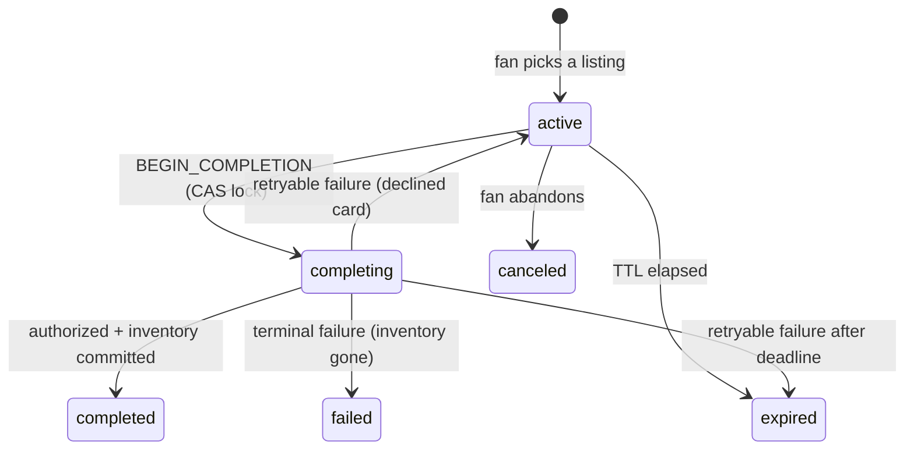

# Checkout Continuity

A fan starts buying tickets on their laptop, gets interrupted, and finishes on their phone — without
duplicate orders, stale holds, or a price that quietly changed underneath them.

```bash
pnpm install
pnpm dev      # API on :4000, web on :3000
pnpm test     # 100 tests, ~1s, zero sleeps
```

Open **http://localhost:3000/demo** — one session on two surfaces, with the levers to move the price,
pull the inventory, break the payment processor, and run the clock out.

For a real phone: `pnpm tunnel` (ngrok), then open the https URL. The QR encodes whichever host you
loaded the page from, so a tunnel — or a LAN IP — just works.

### The 60-second tour

1. **Raise the price $20.** Both surfaces show the drift banner within a second, both buy buttons
   disable, and neither will complete until the fan explicitly accepts.
2. **Set payment to "Slow", then press Complete on both surfaces at once.** One order is created.
   The other says *"Completing on your other device."*
3. **Sell out the listing.** Both surfaces reach a recovery state; the API refuses the purchase.
4. **Expire now.** Both flip to a recovery screen offering the same seats at the current price.

Nothing reloads — every change arrives over SSE. Each beat is also asserted headlessly in
[`checkout.integration.test.ts`](apps/api/src/routes/checkout.integration.test.ts).

---

## What's here

```
apps/api            Express 5 — source of truth, in-memory stores, SSE
apps/web            Next.js 15 App Router — desktop + mobile surfaces, demo console
packages/contracts  Zod schemas shared by both ends
```

`packages/contracts` is the API boundary: the server validates inbound requests against those
schemas and the web app parses every response through them, so a contract change breaks both sides at
compile time rather than at runtime in front of a fan.

Express is a separate service rather than Next route handlers because the premise is two independent
surfaces talking to one backend. Server Components fetch from it during SSR, so the browser never
makes the first request; browser-side calls are proxied same-origin through `next.config.ts`, which
is what lets one tunnel serve a phone.

---

## The session state model

Two orthogonal axes — the same split Stripe makes between a Checkout Session's `status` and its
`payment_status`:

| Axis | Values |
| --- | --- |
| `status` — lifecycle | `active` · `completing` · `completed` · `expired` · `canceled` · `failed` |
| `completion.status` — the in-flight attempt | `pending` · `succeeded` · `failed` |



**"Payment pending" is not a lifecycle state** — it is `completing` + `completion.status: pending`.
Collapsing the axes is how this rots into `active_but_price_changed_and_payment_pending`. The machine
is a pure function, small enough to test as a transition matrix in
[`checkout-machine.test.ts`](apps/api/src/domain/checkout-machine.test.ts); the service around it
does the I/O and is deliberately dumb — read, reduce, compare-and-swap, publish.

### Stored vs. computed

The persisted session is **the fan's agreement and nothing else** — no cached price, no
`hasPriceChanged` flag, no stored drift. The world *right now* is recomputed on every read:

```ts
{
  session,      // the agreement
  liveQuote,    // current reality — null if the listing is gone or sold out
  drift,        // the diff between them
  remainingMs,  // server-authoritative, so the first HTML paint has a real countdown
  serverTime,   // lets the client correct a skewed device clock
  canComplete,  // the server's verdict
  blockers      // …and why not
}
```

Persisting a comparison is how you end up serving a "price went up!" banner for a price that has
since gone back down. The client holds a cached copy of that view, a per-tab `clientId`, and
transient UI state — no price, deadline or eligibility decision is computed client-side.

---

## How web and mobile resume the same session

```
Desktop   /checkout/{id}
Mobile    /m/checkout/{id}
Deep link /link/{id}  →  302 to the mobile surface with ?src=deeplink
```

The session id *is* the resume mechanism, and it is the URL. `/link/{id}` is the deep link: a
universal link is an HTTPS URL exactly like it, claimed by the native app through
`apple-app-site-association` when installed and falling through to the web when not — which is why a
deep link should never be a bare custom scheme that dead-ends for everyone without the app.

Both routes are Server Components fetching the same session by the same id; nothing about resuming is
special-cased. A surface never decides whether the session is valid — every read returns
`canComplete`, `blockers` and a server-computed `remainingMs`.

### The live channel

SSE rather than WebSockets: purely server→client, plain HTTP with no upgrade path or sticky sessions,
and `EventSource` gives reconnection for free. If the stream drops the client polls instead, and says
so. Every payload carries the **full view** rather than a patch — full-state pushes are idempotent
and order-insensitive, where patches would need exactly-once delivery.

The detail that matters is **`Last-Event-ID` replay**. Each session keeps a ring buffer of its last
50 events, so a phone that locks and reconnects sends back the last id it processed and we replay
only what it missed. Without it, everything during the gap is lost — the exact failure this feature
exists to prevent, one layer down.

Replay means the client must drop what it has already seen, and "newer" is two clocks, in order:

```ts
incoming.session.version !== cached.session.version
  ? (incoming.session.version > cached.session.version ? incoming : cached)  // a write happened
  : (incoming.serverTime > cached.serverTime ? incoming : cached)            // a re-projection
```

`session.version` orders **mutations**; `serverTime` orders **re-projections of an unchanged
session**, which is exactly what a price change is — the marketplace moved, the fan's agreement did
not. Both halves are load-bearing: version alone discards every `quote.changed` frame, and time alone
lets a replayed projection walk a completed checkout back to `active`, turning a confirmation into a
buy button. Both are pinned in
[`merge-session-view.test.ts`](apps/web/hooks/merge-session-view.test.ts). Across instances the
tiebreak wants a real sequence number, not a clock.

---

## Stale inventory, price changes, duplicate completion

### Duplicate orders — four gates

The ordering in [`completeSession`](apps/api/src/services/checkout-service.ts) is the answer. Each
gate catches a case the next cannot:

1. **`Idempotency-Key`** — the same device retrying. Claimed *before* the work starts, so a retry
   landing during a slow payment call sees the in-flight record instead of starting a second
   authorization.
2. **Terminal-state replay** — a request arriving after the order exists returns `200` with that
   order. A late retry succeeded; saying otherwise would be a lie.
3. **Compare-and-swap into `completing`** — two devices racing. The loser gets `409
   COMPLETION_IN_PROGRESS` carrying `startedBySurface`, so the UI says *"completing on your phone"*
   rather than showing an error.
4. **`UNIQUE (session_id)` on orders** — the only true invariant. It holds even if a future refactor
   forgets the other three exist.

**The critical detail is where the `await` sits.** Single-threaded is not the same as atomic: a
handler that reads a session, awaits a payment call, then writes it back has yielded the event loop
in between, and a second request interleaves exactly there. What makes this safe is that the compare
and the write happen in one synchronous turn, and the lock is taken **strictly before** the payment
provider is awaited. `putIfVersion` maps directly onto a Redis Lua CAS.

### Price changes

Every quote carries a `hash` over the priced fields, behaving like an ETag. Completion requires
**two** things: the hash the fan clicked with must be the live one, *and* the session must already
have that hash **acknowledged**. Only the first is satisfiable by a client refreshing — the second is
what makes *"we never charge an unseen price"* a property of the server rather than a promise about
the frontend. Price drops work identically: the confirmation total must be the total the fan agreed
to, in both directions.

### Stale inventory

**There is deliberately no hard hold.** Gametime is a secondary marketplace — listings are
third-party inventory that can sell on another channel at any moment. Locking seats the way a primary
vendor does would misrepresent the domain and hide the failure a continuity feature has to handle:
the tickets a fan is looking at stop existing while they are away.

So inventory is checked three times, each catching something different — on read for the banner, when
the completion lock is taken (the last point we can refuse *before spending money*), and after
authorization but before the order is written (the only authoritative one).

**No hold means the failure has to be paid for somewhere, and that place is a void.** Two fans can
both be authorized for the last pair of seats; the loser has a live hold on their card when we find
out. `finalizeOrder` carries the invariant — *any exit that does not produce a new order releases
this attempt's authorization* — as one `finally` over the whole body, so a fourth exit added later
cannot silently skip it.

### Expiration

Both mechanisms, because either alone is a bug: **lazily on read**, so a fan refreshing never sees a
live-looking session whose clock has run out; and **a 1-second sweeper**, because an idle fan's open
tabs still need telling and lazy-only expiry fires no SSE event. The countdown runs off an absolute
`expiresAt` corrected by clock skew, so a phone twenty minutes fast doesn't show an expired checkout.

A deadline enforced with `expiresAt <= now` gets the boundary wrong twice, and both cost the fan a
checkout they should have had:

- **The click that beat the clock.** *Submitted* before the deadline and *evaluated* before it are
  not the same instant, so `BEGIN_COMPLETION` alone reads the deadline with `COMPLETION_GRACE_MS` of
  slack. Extend and cancel get none — those are a fan acting on a dead screen, not a request already
  in the air. The grace is invisible (the countdown still hits 0:00 at `expiresAt`) and the sweeper
  holds back by the same margin, or the guarantee is a coin flip against a background job.
- **The deadline that kept running during authorization.** Until the lock is taken the clock measures
  *how long may you shop*; after it, the fan has committed and the remaining time is ours. So
  `BEGIN_COMPLETION` pushes `expiresAt` out by `COMPLETION_WINDOW_MS` in the same atomic transition.
  Otherwise a submit at 9:58 whose card declines at 10:01 sends them back to the start instead of
  letting them try another card.

### Retention

Nothing is deleted at completion, and that is the point: gate 2 needs the completed session to turn a
late retry into `200 { order }`, and the fan's other device needs it to render a confirmation it has
not seen. Terminal is the soft delete; the sweeper does the hard one a retention window later. In
Redis that is an `EXPIRE` set the moment the session goes terminal, not a scan.

---

## Web performance: what appears before hydration

Measured on `/checkout/[id]` against `next build && next start`, warm, five runs:

| | |
| --- | --- |
| **TTFB** | **~20 ms** — shell, price, seats, countdown |
| Stream complete | ~275 ms (the delivery panel deliberately takes 250 ms) |
| HTML | 23 KB · 8.5 KB gzipped |
| First Load JS, `/checkout/[id]` | 134 KB |

That gap *is* the streaming story: the shell is out of the door while a slow secondary panel resolves
behind a Suspense boundary. In the first HTML byte: event, venue, section and row, itemised price,
the total, any drift banner, and a countdown already reading `9:59` — with the submit button rendered
*enabled*, inside a real `<form>` carrying hidden `quoteHash` and `idempotencyKey` fields.

**The countdown is correct before hydration.** `useState` plus a `useEffect` timer renders `--:--`
until JS hydrates, and on a checkout page the timer *is* the pressure.
[`Countdown`](apps/web/components/countdown.tsx) uses `useSyncExternalStore`, whose
`getServerSnapshot` React calls during SSR *and* during hydration before switching to `getSnapshot`:
first paint shows a real number and hydration matches by construction, with no
`suppressHydrationWarning` papering over a difference nobody checked.
[`countdown.test.tsx`](apps/web/components/countdown.test.tsx) pins this through `renderToString` in
Node with no jsdom, since a browser environment would let a passing test coexist with a blank paint.

**Checkout works with JavaScript disabled.** Completing, accepting a price change and extending are
plain form POSTs to Server Actions; client components only add pending states on top. It is also why
the forms carry a server-generated `idempotencyKey` — with no JS there is no button to disable, so a
double-click posts twice with one key.

Layout is reserved for content that hasn't arrived, because CLS on a checkout is a mis-tap that buys
the wrong thing. Caching matches volatility: `/checkout/[id]` is `force-dynamic`, the catalogue is
`revalidate = 60`.

---

## API

```
POST   /api/checkout/sessions                  → 201 view
GET    /api/checkout/sessions/:id              → 200 view   (200 even when terminal)
POST   /api/checkout/sessions/:id/acknowledge    quoteHash
POST   /api/checkout/sessions/:id/extend
POST   /api/checkout/sessions/:id/complete       quoteHash + Idempotency-Key (required)
POST   /api/checkout/sessions/:id/cancel
GET    /api/checkout/sessions/:id/events         SSE, honours Last-Event-ID
POST   /api/_scenario/*                          dev only
```

**`GET /:id` returns 200 for expired and cancelled sessions, not 404/410.** A resuming surface needs
the event, seats and current price to render *"that expired — those seats are still $563, start
again"*; a 404 strands the deep link. Every 4xx likewise carries the current view, so a client
hitting a 409 reconciles from that response instead of racing a follow-up GET.

**There is no `If-Match`.** The obvious design accepts `If-Match: <session version>` on every
mutation, and no client can use it: `GET /sessions/:id` records that a surface looked, which is a
write, so opening the checkout on a phone advances the version the laptop holds. A precondition a
third party *glancing at their screen* invalidates produces 409s that mean nothing to the fan. Each
mutation instead guards the thing actually at risk — `quoteHash`, the CAS lock, `Idempotency-Key` —
and for the same reason a lost CAS returns the reducer's verdict rather than `VERSION_CONFLICT`.

---

## Instrumenting for conversion

Designed, not built — see *Out of scope*.

A generic funnel tells you sessions converted at N%. It cannot tell you whether the fan who switched
devices converted better than the fan who didn't — the only question that justifies building any of
this. So the handoff has to be a first-class dimension: terminal events carry `surfaceCount`, resume
events carry `fromSurface`, `toSurface` and `gapSeconds`.

- **Single- vs multi-surface conversion** — the whole argument. A cross-device checkout is one that
  survived an interruption; without continuity most are lost, so the multi-surface rate *not
  collapsing* is the evidence the feature earns its complexity.
- **Continuity rate** — completed sessions touching ≥2 surfaces ÷ *distinct sessions* that reached a
  second surface. Dividing by resume events would measure refreshes.
- **Drift-shown → drift-accepted** — what a price rise costs at the last step.
- **Median resume gap** — sizes the TTL directly.
- **Duplicates blocked** — should be non-zero; if it is always zero the guard is untested.

An event stream keyed on the session, rather than an in-process counter, is what lets these be sliced
by device pair, gap length and drift after the fact.

---

## Tests

Time is an injected `Clock`, so a ten-minute TTL is exercised by advancing a fake clock, not waiting.

- **[`checkout-machine.test.ts`](apps/api/src/domain/checkout-machine.test.ts)** — the transition
  table as a data-driven matrix, plus the price-safety rules. Pure function: no server, no store.
- **[`checkout.integration.test.ts`](apps/api/src/routes/checkout.integration.test.ts)** — the full
  flow over real HTTP: cross-surface handoff, `Promise.all` double-completion producing exactly one
  order, idempotent replay, key reuse, drift → 409 → acknowledge → complete, inventory vanishing
  mid-authorization, decline-then-retry, pending authorization, lazy and swept expiry, retention.
  Two boundaries worth singling out: a purchase landing a hair after 0:00 still completes, and two
  fans racing for the last seats leave one order and no stranded authorization.
- **[`event-bus.test.ts`](apps/api/src/stores/event-bus.test.ts)** — `Last-Event-ID` replay, buffer
  bounding. **[`merge-session-view.test.ts`](apps/web/hooks/merge-session-view.test.ts)** — the fold
  the SSE handler runs, over full views parsed by the real schema.
- **[`countdown.test.tsx`](apps/web/components/countdown.test.tsx)** — what the server renders before
  hydration: a real duration, the server's number rather than a skewed device's, `0:00` rather than
  negative time.

---

## Tradeoffs

**No inventory hold** — argued above; a domain judgment, not a shortcut, and it makes the sold-out
path a first-class demo rather than a hidden branch.

**In-memory everything.** The interfaces are shaped for the real thing: `putIfVersion` → Redis Lua
CAS, `SessionEventBus` → Redis pub/sub plus a capped stream, orders → `UNIQUE (session_id)`.

**A simulated mobile surface, not a native app.** A real Expo client would be a stronger answer to
"cross-surface", but it would have starved the state model and the tests, which is where the risk in
this problem lives. The mobile route is still a genuine second surface — separate route, separate
presentation, same API, reachable by deep link.

**Dropped Redux and shadcn/ui**, both in my original `PLANNING.md` stack. There turned out to be no
client-only global state worth a store — the session is server state pushed over SSE.

### Out of scope

Left out on purpose, to keep this a focused slice rather than a shallow checkout clone:

- **Payment** — stubbed behind a `PaymentProvider` interface with approve / decline / pending / error
  modes. No forms, no PSP integration.
- **Auth** — the consequence is that the session id is a bearer token. Real deployment binds the
  session to an account and signs the deep link.
- **Persistence, message broker, audit log** — all in-memory; the store interfaces make the swap
  mechanical.
- **Analytics implementation** — designed above rather than built. An in-process counter no surface
  reads is scope without a consumer.

## What I'd do differently with more time

1. **Playwright over two browser contexts.** The double-completion race is covered at the API level,
   but the *UI* behaviour — one surface flipping to "completing on your other device" while the other
   lands on a confirmation — is asserted by hand today. That is the test I most want.
2. **Bind sessions to accounts** and sign deep links, closing the bearer-token gap.
3. **Move expiry off the sweeper.** A 1-second interval scanning every session is O(n) per tick; a
   Redis sorted set keyed on `expiresAt` is the real shape.
4. **Reconcile pending authorizations on startup.** If the process dies while a session is
   `completing` it stays locked forever — the one durability hole I know is open.
5. **Cover the SSE route itself.** `SessionEventBus` is tested in isolation, but header parsing,
   framing and disconnect cleanup are only exercised by hand through `/demo`.
6. **Accessibility pass.** Live regions are wired for the countdown and drift banner, but I have not
   run a screen reader over the handoff flow.

---

## Agent Usage

I took the following steps when using AI to assist me through this project.

1. I conversed with Gemini to discuss high level architecture and brainstorm what technical decisions
   made sense to include in this first version and what to put as out of scope. I also pointed out
   edge cases and went back and forth with it on covering those edge cases.

2. After mentally deciding on an approach, I wrote up my `PLANNING.md` doc with the intention of using
   Claude Code to read this for the base setup.

3. In Claude Code plan mode (Opus) I referenced the file and told it to write a plan. It read the
   assignment PDF and my notes, then generated a plan. I went back and forth a bit. As an example, one topic was how ticket resale site like Gametime should handle locking and high traffic a bit differently than primary selling sites like Ticketmaster.

4. One the plan was final, I executed it with Sonnet. I manually reviewed each part and approved or made changes where necessary.

5. I reviewed both the base code and the UI. I gathered the bugs in the UI and wrote a plan to fix them. Quickly followed by execution.

6. Despite attempts to avoid AI slop and bloated code, I still had to go back and remove some features that seemed like over engineering, not directly related to the prompt, or UI that was unnecessary.

7. I went deeper into some specific features like idempotency, atomic transactions, SSE, and more.
