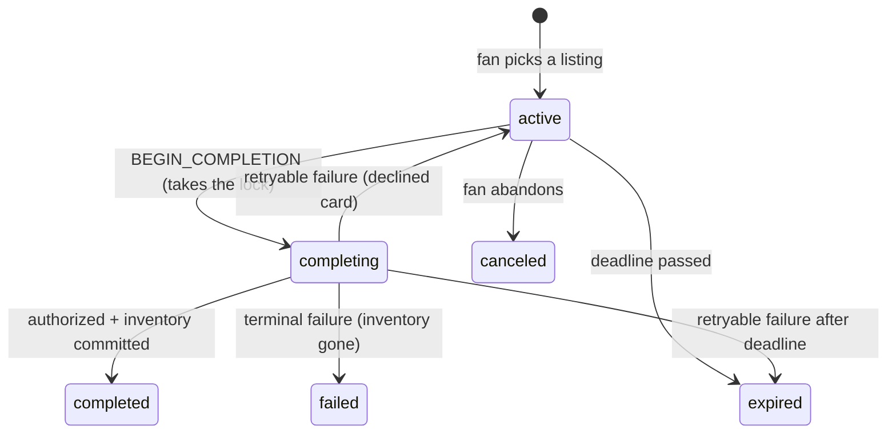

# Checkout Continuity

A fan starts buying tickets on their laptop, gets interrupted, and finishes on their phone — without
duplicate orders, stale holds, or a price that quietly changed underneath them.

```bash
pnpm install
pnpm dev      # API on :4000, web on :3000
pnpm test     # 67 tests, ~1s, zero sleeps
```

Open **http://localhost:3000/demo** — one session on two surfaces, with the levers to move the price,
pull the inventory, break the payment processor, and run the clock out.

For a real phone: put the phone on the same Wi-Fi and open the app at your machine's network address
(`http://192.168.x.x:3000`) rather than `localhost`. The handoff QR encodes whichever host served the
page, so it then points at something the phone can reach. `PUBLIC_ORIGIN` in `apps/web/.env.local`
overrides that if you need a different address.

### The 60-second tour

1. **Raise the price $20.** Both surfaces show the drift banner within a second, both buy buttons
   disable, and neither will complete until the fan explicitly accepts.
2. **Set payment to "Slow", then press Complete on both surfaces at once.** One order is created.
   The other says *"Completing on your other device."*
3. **Sell out the listing.** Both surfaces reach a recovery state; the API refuses the purchase.
4. **Expire now.** Both flip to a recovery screen offering the same seats at the current price.

Nothing reloads — every change arrives over SSE. Each beat is also asserted headlessly in
[`checkout.integration.test.ts`](apps/api/src/routes/checkout.integration.test.ts).

---

## What's here

```
apps/api            Express 5 — source of truth, in-memory stores, SSE
apps/web            Next.js 15 App Router — desktop + mobile surfaces, demo console
packages/contracts  Zod schemas shared by both ends
```

`packages/contracts` is the API boundary: the server validates inbound requests against those
schemas and the web app parses every response through them, so a contract change breaks both sides at
compile time rather than at runtime in front of a fan.

Express is a separate service rather than Next route handlers because the premise is two independent
surfaces talking to one backend. Server Components fetch from it while rendering, so the browser never
makes the first request; browser-side calls are proxied same-origin through `next.config.ts`, so the
phone reaches the API through the same address it loaded the page from.

---

## The session state model

Two orthogonal axes — the same split Stripe makes between a Checkout Session's `status` and its
`payment_status`:

| Axis | Values |
| --- | --- |
| `status` — lifecycle | `active` · `completing` · `completed` · `expired` · `canceled` · `failed` |
| `completion.status` — the in-flight attempt | `pending` · `succeeded` · `failed` |



**"Payment pending" is not a lifecycle state** — it is `completing` + `completion.status: pending`.
Collapsing the axes is how this rots into `active_but_price_changed_and_payment_pending`. The machine
is a pure function, small enough to test as a transition matrix in
[`checkout-machine.test.ts`](apps/api/src/domain/checkout-machine.test.ts); the service around it
does the I/O and is deliberately dumb — read the session, run the machine, write it back if nobody
else has, publish what changed.

### Stored vs. computed

The persisted session is **the fan's agreement and nothing else** — no cached price, no
`hasPriceChanged` flag, no stored drift. The world *right now* is recomputed on every read:

```ts
{
  session,      // the agreement
  liveQuote,    // current reality — null if the listing is gone or sold out
  drift,        // the diff between them
  remainingMs,  // server-authoritative, so the first HTML paint has a real countdown
  serverTime,   // lets the client correct a skewed device clock
  canComplete,  // the server's verdict
  blockers      // …and why not
}
```

Persisting a comparison is how you end up serving a "price went up!" banner for a price that has
since gone back down. The client holds a cached copy of that view, a per-tab `clientId`, and
transient UI state — no price, deadline or eligibility decision is computed client-side.

---

## How web and mobile resume the same session

```
Desktop   /checkout/{id}
Mobile    /m/checkout/{id}
Deep link /link/{id}  →  302 to the mobile surface with ?src=deeplink
```

The session id *is* the resume mechanism, and it is the URL. `/link/{id}` is the deep link: a
universal link is an HTTPS URL exactly like it, claimed by the native app through
`apple-app-site-association` when installed and falling through to the web when not — which is why a
deep link should never be a bare custom scheme that dead-ends for everyone without the app.

Both routes are Server Components fetching the same session by the same id; nothing about resuming is
special-cased. A surface never decides whether the session is valid — every read returns
`canComplete`, `blockers` and a server-computed `remainingMs`.

### The live channel

SSE rather than WebSockets: purely server→client, plain HTTP with no upgrade path or sticky sessions,
and `EventSource` gives reconnection for free. If the stream drops the client polls instead, and says
so. Every payload carries the **full view** rather than a patch — full-state pushes are idempotent
and order-insensitive, where patches would need exactly-once delivery.

The detail that matters is **`Last-Event-ID` replay**. Each session keeps a capped buffer of its last
50 events, so a phone that locks and reconnects sends back the last id it processed and we re-send
only what it missed. Without it, everything during the gap is lost — the exact failure this feature
exists to prevent, one layer down.

Re-sending means the client must drop what it has already seen, and "newer" is decided by two values,
in order:

```ts
incoming.session.version !== cached.session.version
  ? (incoming.session.version > cached.session.version ? incoming : cached)  // a write happened
  : (incoming.serverTime > cached.serverTime ? incoming : cached)            // nothing was written
```

`session.version` orders **writes to the session**; `serverTime` breaks ties when the session was
rebuilt without being written, which is exactly what a price change is — the listing moved, the fan's
agreement did not. Both halves are load-bearing: version alone discards every price change, since
they all arrive at the same version, and time alone lets a re-sent update walk a completed checkout
back to `active`, turning a confirmation into a buy button. Both are pinned in
[`merge-session-view.test.ts`](apps/web/hooks/merge-session-view.test.ts). Across several servers the
tiebreak would need a real sequence number rather than a clock.

---

## Stale inventory, price changes, duplicate completion

### Duplicate orders — four guards

The ordering in [`completeSession`](apps/api/src/services/checkout-service.ts) is the answer. Each
guard catches a case the others cannot:

1. **`Idempotency-Key`** — the same device retrying. Claimed *before* the work starts, so a retry
   landing during a slow payment call finds the in-flight record instead of starting a second charge.
2. **The already-completed check** — a request arriving after the order exists returns `200` with
   that order, because the retry did in fact succeed.
3. **The version check on the write into `completing`** — two devices racing. The one that loses gets
   `409 COMPLETION_IN_PROGRESS` carrying `startedBySurface`, so the UI can say *"completing on your
   phone"* rather than show an error.
4. **`UNIQUE (session_id)` on orders** — the only guard a caller cannot bypass. It holds even if a
   future refactor forgets the other three exist.

**The critical detail is where the `await` sits.** Node being single-threaded does not make this
safe on its own: a handler that reads a session, `await`s a payment call, then writes it back has let
other work run in between, and a second request slips in exactly there. What makes it safe is that
the version check and the write happen with no `await` between them, and that the lock is taken
**strictly before** the payment provider is called. `putIfVersion` maps directly onto a small Redis
Lua script.

### Price changes

Every quote carries a `hash` over the priced fields, so comparing two hashes answers "is this still
the same price?" — the same idea as an HTTP `ETag`. Completion requires
**two** things: the hash the fan clicked with must be the live one, *and* the session must already
have that hash **acknowledged**. Only the first is satisfiable by a client refreshing — the second is
what makes *"we never charge an unseen price"* a property of the server rather than a promise about
the frontend. Price drops work identically: the confirmation total must be the total the fan agreed
to, in both directions.

### Stale inventory

**There is deliberately no hard hold.** Gametime is a secondary marketplace — listings are
third-party inventory that can sell on another channel at any moment. Locking seats the way a primary
vendor does would misrepresent the domain and hide the failure a continuity feature has to handle:
the tickets a fan is looking at stop existing while they are away.

So inventory is checked three times, each catching something different — on read for the banner, when
the completion lock is taken (the last point we can refuse *before spending money*), and after
authorization but before the order is written (the only authoritative one).

**No hold means someone has to pay for the failure, and here that means releasing the charge.** Two
fans can both be authorized for the last pair of seats, and the one who loses has a live hold on
their card by the time we find out. `finalizeOrder` guarantees that *any exit that does not produce
an order releases that hold*, using one `finally` over the whole body so a new exit added later
cannot silently skip it.

### Expiration

Both mechanisms, because either alone is a bug: **on read**, so a fan refreshing never sees a
live-looking session whose clock has run out; and **a 1-second sweeper**, because an idle fan's open
tabs still need telling, and expiring only on read sends them no event at all. The countdown runs off
an absolute `expiresAt`, corrected for a device clock that is set wrong, so a phone twenty minutes
fast does not show an expired checkout.

A deadline enforced with `expiresAt <= now` gets the boundary wrong twice, and both cost the fan a
checkout they should have had:

- **The click that beat the clock.** Submitting before the deadline and being *evaluated* before it
  are not the same instant, so `BEGIN_COMPLETION` alone gets `COMPLETION_GRACE_MS` of extra time.
  Extend and cancel get none — those are a fan acting on a dead screen, not a request that was
  already on its way. The extra time is never visible (the countdown still hits 0:00 at `expiresAt`),
  and the sweeper respects the same margin, or it would be a coin flip which landed first.
- **The deadline that kept running during payment.** Until the lock is taken, the clock measures how
  long the fan may shop; after it, they have committed and the remaining time is ours. So
  `BEGIN_COMPLETION` pushes `expiresAt` out by `COMPLETION_WINDOW_MS` in the same write. Otherwise a
  submit at 9:58 whose card declines at 10:01 sends them back to the start instead of letting them
  try another card.

### Retention

Nothing is deleted at completion, and that is the point: guard 2 needs the completed session to turn
a late retry into `200 { order }`, and the fan's other device needs it to show a confirmation it has
not seen yet. Finishing a checkout only marks it done; the sweeper actually deletes it a retention
period later. In Redis that would be an `EXPIRE` set the moment the session finished, not a scan.

---

## Web performance: what appears before hydration

Measured on `/checkout/[id]` against `next build && next start`, warm, five runs:

| | |
| --- | --- |
| **Time to first byte** | **~13 ms** — page, price, seats, countdown |
| Stream complete | ~261 ms (the delivery panel deliberately takes 250 ms) |
| HTML | 22.5 KB · 8.3 KB gzipped |
| First Load JS, `/checkout/[id]` | 134 KB |

That gap *is* the streaming story: the page is out of the door while a slow secondary panel resolves
behind a Suspense boundary. In the first HTML: event, venue, section and row, itemized price, the
total, any drift banner, and a countdown already reading `9:59` — with the submit button rendered
*enabled*, inside a real `<form>` carrying hidden `quoteHash` and `idempotencyKey` fields.

**The countdown is right before any JavaScript runs.** `useState` plus a `useEffect` timer would
render `--:--` until the page hydrates, and on a checkout page the timer is the whole point.
[`Countdown`](apps/web/components/countdown.tsx) uses `useSyncExternalStore`, whose
`getServerSnapshot` React calls both when rendering on the server *and* while hydrating, before
switching to `getSnapshot`: the first HTML carries a real number, and hydration matches it
automatically rather than needing `suppressHydrationWarning`.
[`countdown.test.tsx`](apps/web/components/countdown.test.tsx) pins this through `renderToString` in
plain Node, with no fake browser environment — in a browser environment the test could pass while
the server still sent an empty page.

**Checkout works with JavaScript disabled.** Completing, accepting a price change and extending are
plain form POSTs to Server Actions; client components only add pending states on top. It is also why
the forms carry a server-generated `idempotencyKey` — with no JS there is no button to disable, so a
double-click posts twice with one key.

Layout is reserved for content that has not arrived yet, because a page that shifts under someone's
thumb on a checkout is a mis-tap that buys the wrong thing. Caching matches how fast each thing
changes: `/checkout/[id]` is `force-dynamic`, the event page is
`revalidate = 30` because it carries prices, and the index — names, venues, dates — is `60`.

---

## API

```
POST   /api/checkout/sessions                  → 201 view
GET    /api/checkout/sessions/:id              → 200 view   (200 even when terminal)
POST   /api/checkout/sessions/:id/acknowledge    quoteHash
POST   /api/checkout/sessions/:id/extend
POST   /api/checkout/sessions/:id/complete       quoteHash + Idempotency-Key (required)
POST   /api/checkout/sessions/:id/cancel
GET    /api/checkout/sessions/:id/events         SSE, honors Last-Event-ID
POST   /api/_scenario/*                          dev only
```

**`GET /:id` returns 200 for expired and canceled sessions, not 404/410.** A device picking the
checkout back up needs the event, seats and current price to show *"that expired — those seats are
still available, start again"*; a 404 leaves a scanned link with nowhere to go. Every 4xx likewise
carries the current view, so a client refused with a 409 can update from that same response instead
of making a second request.

**There is no `If-Match`.** The obvious design accepts `If-Match: <session version>` on every write,
and no client can actually use it: `GET /sessions/:id` records that a surface looked, which is itself
a write, so opening the checkout on a phone advances the version the laptop is holding. A
precondition that someone *glancing at their other screen* invalidates produces 409s that mean
nothing to the fan. Each write instead guards the thing actually at risk — `quoteHash`, the
completion lock, `Idempotency-Key` — and for the same reason, a write that loses the version check
returns the state machine's answer rather than `VERSION_CONFLICT`.

---

## Instrumenting for conversion

A standard conversion funnel tells you sessions converted at N%. It cannot tell you whether the fan
who switched devices converted better than the fan who didn't, which is the question this feature is
built to answer. So the handoff has to be recorded directly rather than inferred later from page
views. Three events go through [`AnalyticsSink`](apps/api/src/ports/analytics.ts) today:
`session.resumed` carries `fromSurface`, `toSurface`, `gapSeconds` and `viaDeepLink`;
`checkout.completed` carries `surfaceCount`; `duplicate.blocked` fires from both guards that stop a
second order. They are emitted server-side from `CheckoutService`, and asserted in the cross-surface
and double-completion tests, so they cannot quietly stop firing.

Those three support the measures worth having:

- **Single- vs multi-surface conversion** — the whole argument. A cross-device checkout is one that
  survived an interruption; without continuity most are lost, so the multi-surface rate *not
  collapsing* is the evidence the feature earns its complexity.
- **Continuity rate** — completed sessions touching ≥2 surfaces ÷ *distinct sessions* that reached a
  second surface. Dividing by resume events would measure refreshes.
- **Drift-shown → drift-accepted** — what a price rise costs at the last step.
- **Median resume gap** — tells you directly how long the session deadline should be.
- **Duplicates blocked** — should be non-zero; if it is always zero the guard is untested.

### Where the events should go

**Product analytics (Mixpanel, PostHog).** Funnels, retention and cohorts with no pipeline to run,
and a PM can ask a new question without an engineer. But a client-side library loses events to ad
blockers and to Safari's tracking protection, and on a checkout the fans you lose are exactly the
ones you care about — privacy-conscious, Safari, mobile. Worse here specifically: web plus a native
app means two client libraries and a vendor guessing which device is which person, and *that guess
is the exact thing being measured*. Building the continuity number on top of it would measure the
vendor's heuristic as much as the feature.

**Our own capture endpoint → Pub/Sub → BigQuery.** Emitted server-side, so nothing is blocked and
there is no guessing which device belongs to which person — the session id already links them, which
is the point of the whole design. It lands in the same warehouse as orders, listings and payments, so
"did multi-surface sessions convert better" is one SQL join rather than a vendor export. Pub/Sub
keeps the write off the request path, so an analytics outage cannot slow a checkout. The costs are
real: retention, schema changes, backfills and personal-data policy all become ours, and there is no
funnel UI — Looker or Metabase still has to sit on top, so "no vendor" is not quite honest.

**Where I'd land:** both, split by whether the number has to agree with money. Product analytics for
exploratory funnels, where being able to ask quickly beats being complete and some loss is
tolerable. The warehouse stream for conversion rate, duplicates blocked and drift accepted — those
have to match the orders table exactly. Emitting everything through one interface makes sending to
both a wiring change in `container.ts` rather than a code change.

---

## Tests

Time comes from an injected `Clock`, so a ten-minute deadline is exercised by advancing a fake clock
rather than waiting.

- **[`checkout-machine.test.ts`](apps/api/src/domain/checkout-machine.test.ts)** — the transition
  table as a data-driven matrix, plus the price-safety rules. Pure function: no server, no store.
- **[`checkout.integration.test.ts`](apps/api/src/routes/checkout.integration.test.ts)** — the full
  flow over real HTTP: cross-surface handoff, `Promise.all` double-completion producing exactly one
  order, idempotent replay, key reuse, drift → 409 → acknowledge → complete, inventory vanishing
  mid-authorization, decline-then-retry, pending authorization, lazy and swept expiry, retention.
  Two boundaries worth singling out: a purchase landing a hair after 0:00 still completes, and two
  fans racing for the last seats leave one order and no stranded authorization.
- **[`event-bus.test.ts`](apps/api/src/stores/event-bus.test.ts)** — catching a reconnected client
  up on what it missed, and the buffer staying capped.
  **[`merge-session-view.test.ts`](apps/web/hooks/merge-session-view.test.ts)** — the merge the
  update handler runs, over full views parsed by the real schema.
- **[`countdown.test.tsx`](apps/web/components/countdown.test.tsx)** — what the server renders before
  any JavaScript runs: a real duration, the server's number rather than a wrongly-set device's, and
  `0:00` rather than negative time.

---

## Tradeoffs

**No inventory hold** — argued above; a domain judgment, not a shortcut, and it makes the sold-out
path a first-class demo rather than a hidden branch.

**In-memory everything.** The interfaces are shaped for the real thing: `putIfVersion` → a small
Redis Lua script, `SessionEventBus` → Redis pub/sub plus a capped stream, orders →
`UNIQUE (session_id)`.

**The API runs from source under `tsx`; only the web app has a build step.** `@gametime/contracts`
ships TypeScript rather than compiled output, which Next transpiles and `tsx` executes directly —
convenient for a prototype where both ends move together, and the thing to change first for a real
deployment. `pnpm build` is therefore `next build`, which is what the numbers above are measured
against.

**A simulated mobile surface, not a native app.** A real Expo client would be a stronger answer to
"cross-surface", but it would have starved the state model and the tests, which is where the risk in
this problem lives. The mobile route is still a genuine second surface — separate route, separate
presentation, same API, reachable by deep link.

**Dropped Redux and shadcn/ui**, both in my original `PLANNING.md` stack. There turned out to be no
client-only global state worth a store — the session is server state pushed over SSE.

### Out of scope

Left out on purpose, to keep this a focused slice rather than a shallow checkout clone:

- **Payment** — stubbed behind a `PaymentProvider` interface with approve / decline / pending / error
  modes. No forms, no real payment processor.
- **Auth** — the consequence is that the session id is a bearer token. Real deployment binds the
  session to an account and signs the deep link.
- **Persistence, message broker, audit log** — all in-memory; the store interfaces make the swap
  mechanical.
- **Analytics aggregation** — the events are emitted against a port with a console sink; the
  pipeline, warehouse and dashboards on the other end of it are not here. Building a funnel UI
  nothing queries would be scope without a consumer.

## What I'd do differently with more time

1. **Playwright over two browser contexts.** The double-completion race is covered at the API level,
   but the *UI* behaviour — one surface flipping to "completing on your other device" while the other
   lands on a confirmation — is asserted by hand today. That is the test I most want.
2. **Bind sessions to accounts** and sign deep links, closing the bearer-token gap.
3. **Move expiry off the sweeper.** A 1-second interval scanning every session is O(n) per tick; a
   Redis sorted set keyed on `expiresAt` is the real shape.
4. **Reconcile pending authorizations on startup.** If the process dies while a session is
   `completing` it stays locked forever — the one durability hole I know is open.
5. **Cover the SSE route itself.** `SessionEventBus` is tested in isolation, but header parsing,
   framing and disconnect cleanup are only exercised by hand through `/demo`.
6. **Accessibility pass.** Live regions are wired for the countdown and drift banner, but I have not
   run a screen reader over the handoff flow.

---

## Agent Usage

I took the following steps when using AI to assist me through this project.

1. I conversed with Gemini to discuss high level architecture and brainstorm what technical decisions
   made sense to include in this first version and what to put as out of scope. I also pointed out
   edge cases and went back and forth with it on covering those edge cases.

2. After mentally deciding on an approach, I wrote up my `PLANNING.md` doc with the intention of using
   **Claude Code** to read this for the base setup.

3. In Claude Code plan mode (Opus) I referenced the file and told it to write a plan. It read the
   assignment PDF and my notes, then generated a plan. I went back and forth a bit. As an example, one topic was how ticket resale site like Gametime should handle locking and high traffic a bit differently than primary selling sites like Ticketmaster.

4. Once the plan was final, I executed it with Sonnet. I manually reviewed each part and approved or made changes where necessary.

5. I added a CLAUDE.md file to capture the requirements I wanted in context on every turn — the
   entity model, the SSE and race-condition constraints, and the code quality rules — so I wasn't
   restating them each session or watching them drift out of a compacted context.

6. I reviewed both the base code and the UI. I gathered the bugs in the UI and wrote a plan to fix them. Quickly followed by execution.

7. Despite attempts to avoid AI slop and bloated code, I still had to go back and remove some features that seemed like over engineering, not directly related to the prompt, or UI that was unnecessary.

8. I went deeper into some specific features like idempotency, atomic transactions, SSE, and more. Always thinking about scenarios of many users performing actions at the same time. Also the seller or algorithm randomly making changes to the listing at the exact moment a buyer is attempting an action.

9. I consistently use `/compact` when the context is getting bloated. At times I used git worktrees to work on different features simultaneously. 


